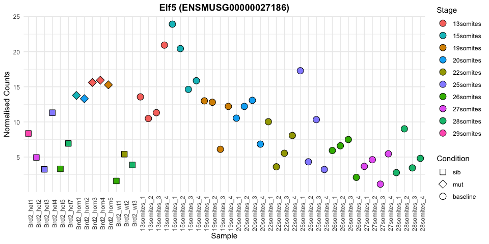

# Baseline CompaRe

Baseline CompaRe is an R Shiny app designed to help with the analysis of
E8.5-10.5 mouse trancriptomics data, particularly in cases where the embryos of
interest are developmentally delayed. We have produced RNA-seq data for
wild-type embryos for stages from 4 to 36 somites to form a baseline for
comparison to experimental samples. This allows us to prioritise genes that
are more likely to be differentially expressed due to the condition of interest,
rather than due to developmental delay.

## Instructions

For instructions about downloading the Shiny app for use locally, please see the
[Installation](#installation) section.

The app assumes you have count data for Ensembl gene ids produced from Illumina
RNA-seq. Count data for the mutant lines presented in Collins et al. 2019 are
available for download from [Figshare](https://doi.org/10.6084/m9.figshare.6819611).
See the [Preprocessed data](#preprocessed-data) section.
Our baseline data was produced from Illumina RNA-seq, mapped with
[TopHat2](https://ccb.jhu.edu/software/tophat/index.shtml) and counted with
[HTSeq-count](https://htseq.readthedocs.io/en/release_0.10.0/count.html).

### File Upload

Upload a samples file and a counts file.

<div class="file-format-content" ></div>

### Principal Component Analysis (PCA)

When the "Analyse Data" button is clicked, the App does PCA on the data to
tell if the experimental samples are compatible with the baseline data. The
experimental samples should not cluster on their own in the PCA. It is possible
that mutant samples will cluster away from the baseline, but the sibling
embryos should be close to similarly staged baseline embryos as in the example
below. Two plots are produced, one containing baseline samples that match the
stages represented in the experimental data and one with all the baseline
samples.

**_If your samples are clustered away from the baseline samples, this analysis is
probably not appropriate._**

#### PCA: Baseline sample for experimental stages included


#### PCA: All Baseline samples included


Use the "PCA Options" sidepanel to select which Principal Components are plotted
against each other and whether to plot sample names. The plots can de downloaded
in various formats. "Download Current Plot" saves only the current plot of
two principal components plotted against each other. "Download all PCs" produces
a pdf file of each component plotted against the next. The current plot can also
be downloaded as a .rda file for loading into R and customising later.

### DESeq2 Analysis

Once the PCA is finished, the DESeq2 analysis is started. For full details of
the method, please see Collins et al. Briefly, DESeq2 is run three
different ways (shown below) and the significant gene lists are overlapped to produce the
results set.

|Analysis Set|Samples|DESEq2 model|
|------------|-------|------------|
|Experiment Only|Experimental Data only| counts ~ (sex +) condition|
|Experiment + Baseline|Experimental Data and stage-matched Baseline samples| counts ~ (sex +) condition|
|Experiment + Baseline with Stage|Experimental Data and stage-matched Baseline samples| counts ~ (sex +) stage + condition|

#### Results

The lists of significantly differentially expressed genes from the three
different analyses are overlapped and the results sets are produced as in the
diagram below.


The results sets can be selected by clicking on the button on the left of the
"Results" tab.
The Mutant Response set should be enriched for genes whose differential
expression is due to the condition and not due to stage differences between
mutant and sibling samples. The Experimental Only significant results are
available as well for comparison, as is a table of all the genes in the
analysis with log2 fold changes and adjusted pvalues for each DESeq2 run.

The full results table can be downloaded and a text file of saved as a .rda
file for loading into R.

#### Count Plot

Clicking on a line of the results table produces a count plot for the selected
gene showing the normalised counts as calculated by DESeq2. Shapes indicate
Condition and Stage is plotted as colour.

##### Mutant Response Example


##### Delay Example



<h3 id="preprocessed-data">Preprocessed Data</h3>

All the count data for the lines processed as part of the DMDD project are available
for download from [Figshare](https://doi.org/10.6084/m9.figshare.6819611).
The Figshare fileset consists of files of counts for each individual mutant line
and a single sample info file for all lines. There is also a tar gzipped archive file
for downloading everything at once.

To use this data, download the appropriate count file and the samples file.
You will need to make a separate samples file containg only the samples for the
line to be analysed. For example if are using the count file for the _Hira_
mutant line (Hira-deseq2-blacklist-adj-gt-adj-sex-outliers.tsv) then the samples
file should look like this.

|   |condition|group|stage|somite_number|
|---|---------|-----|-----|-------------|
|Hira_het1|het|M|27somites|27|
|Hira_het2|het|F|24somites|24|
|Hira_het3|het|M|26somites|26|
|Hira_het4|het|F|22somites|22|
|Hira_het5|het|M|26somites|26|
|Hira_het6|het|F|24somites|24|
|Hira_hom1|hom|M|14somites|14|
|Hira_hom2|hom|F|10somites|10|
|Hira_hom3|hom|M|16somites|16|
|Hira_hom4|hom|F|8somites|8|
|Hira_hom6|hom|F|8somites|8|
|Hira_hom7|hom|F|8somites|8|
|Hira_wt2|wt|F|25somites|25|
|Hira_wt3|wt|F|26somites|26|
|Hira_wt4|wt|F|23somites|23|
|Hira_wt5|wt|F|22somites|22|
|Hira_wt6|wt|M|28somites|28|

It is possible to use this app to simply visualise the count data, but in that case
the analysis must still be run first, because the count plots are generated from
the results table.
If you would like to view the data for one of the mutant lines that does not
show developmental delay, you can still use this app.
However you need to ignore all the results tables in the **RESULTS** tab except the
**Experiment Samples Only** table.

<h3 id="installation">Installation</h3>

The code can be download from [GitHub](https://github.com/richysix/baseline_compare)
or using git `git clone https://github.com/richysix/baseline_compare.git`.

The App can also be run directly from GitHub in Rstudio.
```r
library(shiny)
runGitHub('richysix/baseline_compare')
```

To keep the downloaded files for running more than once, supply a `destdir`
```r
library(shiny)
runGitHub('richysix/baseline_compare', destdir = 'path/to/destdir')
# to run the app again
setwd('path/to/destdir')
runApp()
```

### Dependencies

These packages can be installed using `install.packages`

* shiny
* shinycssloaders
* shinyjs
* shinyBS
* DT
* DESeq2
* ggplot2
* reshape2
* scales
* svglite

These packages need to be installed from GitHub

* [shinyMisc](https://github.com/richysix/shinyMisc)
* [biovisr](https://github.com/richysix/biovisr)

```r
library(devtools)
install_github('richysix/shinyMisc')
install_github('richysix/biovisr')
```

