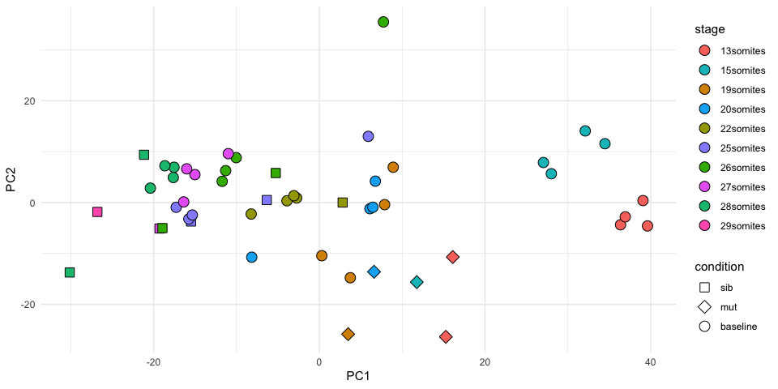

# Baseline CompaRe

Baseline CompaRe is an R Shiny app designed to help with the analysis of
E8.5-10.5 trancriptomics data, particularly in cases where the embryos of
interest are developmentally delayed. We have produced RNA-seq data for
wild-type embryos for stages from 4 to 36 somites to form a baseline for
comparison to experimental samples. This allows us to prioritise genes that
are more likely to be differentially expressed due to the condition of interest,
rather than due to developmental delay.

## Instructions

For instructions about downloading the Shiny app for use locally, please see the
[Installation](#installation) section.

The app assumes you have count data for Ensembl gene ids produced from Illumina
RNA-seq. Our baseline data was produced from Illumina RNA-seq, mapped with
[TopHat2](https://ccb.jhu.edu/software/tophat/index.shtml) and counted with
[HTSeq-count](https://htseq.readthedocs.io/en/release_0.10.0/count.html).

### File Upload

See [File Formats]('#file_formats') section.

### Principal Component Analysis (PCA)

When the "Analyse Data" button is clicked, the App does PCA on the data to
tell if the experimental samples are compatible with the baseline data. The
experimental samples should not cluster on the own in the PCA. It is possible
that mutant samples will cluster away from the baseline, but the sibling
embryos should be close to similarly staged baseline embryos as in the example
below. Two plots are produced, one containing baseline samples that match the
stages represented in the experimental data and one with all the baseline
samples.

**_If your samples are clustered away from the baseline samples, this analysis is
probably not appropriate._**

#### PCA: Baseline sample for experimental stages included



#### PCA: All Baseline samples included


The PCA plots can de downloaded in various formats.

### DESeq2 Analysis

Once the PCA is finished, the DESeq2 analysis is started. For full details of
the method, please see [Collins et al.](). Briefly, DESeq2 is run three
different ways (shown below) and the significant gene lists are overlapped to produce the
results set.

|Analysis Set|Samples|DESEq2 model|
|------------|-------|------------|
|Experiment Only|Experimental Data only| + (sex) + condition|
|Experiment + Baseline|Experimental Data and stage-matched Baseline samples| + (sex) + condition|
|Experiment + Baseline with Stage|Experimental Data and stage-matched Baseline samples| + (sex) + stage + condition|

#### Results

To produce the results sets, the lists of significantly differentially expressed
genes from the three different analyses are overlapped as in the diagram below.


The Mutant Response set should be enriched for genes whose differential
expression is due to the condition and not due to stage differences between
mutant and sibling samples. The Experimental Only significant results are
available as well for comparison as is a table of all the genes in the
analysis with log2 fold changes and adjusted pvalues for each DESeq2 run.

All results tables can be downloaded.

#### Count Plot

Clicking on a line of the results table produces a count plot for the selected
gene showing the normalised counts as calculated by DESeq2. Shapes indicate
Condition and Stage is plotted as colour.

##### Mutant Response Example


##### Delay Example


<h3 id="installation">Installation</h3>

The code can be download from [GitHub](https://github.com/richysix/baseline_compare)
or using git `git clone https://github.com/richysix/baseline_compare.git`.

The App can also be run directly from GitHub in Rstudio.
```r
library(shiny)
runGitHub('richysix/baseline_compare')
```

To keep the downloaded files for running more than once, supply a `destdir`
```r
library(shiny)
runGitHub('richysix/baseline_compare', destdir = 'path/to/destdir')
# to run the app again
setwd('path/to/destdir')
runApp()
```

### Dependencies

These packages can be installed using `install.packages`

* shiny
* shinycssloaders
* shinyjs
* shinyBS
* DT
* DESeq2
* ggplot2
* reshape2
* scales
* svglite

These packages need to be installed from GitHub

* [shinyMisc](https://github.com/richysix/shinyMisc)
* [biovisr](https://github.com/richysix/biovisr)

```r
library(devtools)
install_github('richysix/shinyMisc')
install_github('richysix/biovisr')
```
